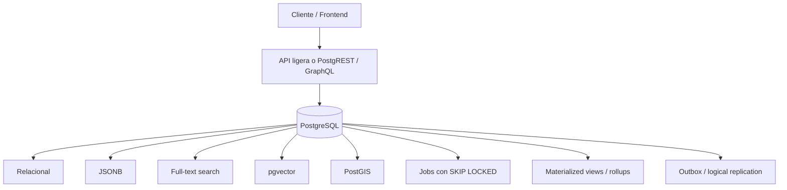

# PostgreSQL como plataforma de aplicación: potencial real, límites reales y patrones aplicables

**Estado del documento:** técnico, pragmático y orientado a implementación.  
**Última verificación:** 2026-05-07.  
**Versión de referencia:** PostgreSQL `current` apunta a PostgreSQL 18.x en la documentación oficial.  
**Tesis:** PostgreSQL puede absorber muchas responsabilidades que los equipos suelen delegar prematuramente a servicios externos. La decisión correcta no es “Postgres para todo”, sino “Postgres primero, especialización después de medir”.

---

## 1. Resumen ejecutivo

PostgreSQL no es solo una base de datos relacional. Es un sistema extensible con transacciones ACID, MVCC, índices avanzados, tipos compuestos, JSONB, búsqueda de texto completo, extensiones para vectores, geoespacial, particionamiento, replicación lógica, seguridad a nivel de fila y primitivas de concurrencia.

Esto permite construir aplicaciones completas con una arquitectura más simple:



El valor no está en eliminar infraestructura por ideología. El valor está en retrasar la complejidad distribuida hasta que exista una necesidad demostrable.

Una regla útil:

> Si el problema puede resolverse de forma correcta, observable y mantenible dentro de PostgreSQL, empieza ahí. Extrae a un sistema especializado cuando las métricas, los límites operativos o los requisitos de producto lo justifiquen.

---

## 2. Qué puede reemplazar PostgreSQL, y bajo qué condiciones

| Necesidad | Solución PostgreSQL | Puede reemplazar parcialmente | Cuándo sí | Cuándo no |
|---|---|---|---|---|
| Datos relacionales | Tablas, constraints, índices, transacciones | RDBMS tradicionales | Casi siempre que el modelo sea transaccional | Si necesitas sharding horizontal complejo desde el día 1 |
| Datos semiestructurados | `jsonb`, GIN, expression indexes, generated columns | MongoDB / document stores | Cuando el núcleo sigue siendo relacional y los campos variables son acotados | Si casi todo es documento arbitrario, sin relaciones ni transacciones multi-entidad |
| Colas de trabajo | `FOR UPDATE SKIP LOCKED`, tablas de jobs, reintentos | Redis Queue, RabbitMQ básico, Sidekiq-like queues | Jobs internos, workloads moderados, necesidad de atomicidad con datos de negocio | Streaming masivo, fan-out complejo, orden total estricto, millones de mensajes/s |
| Búsqueda textual | `tsvector`, `tsquery`, GIN, `pg_trgm` | Elasticsearch/OpenSearch para search bar | Búsqueda de producto, contenido, dashboards internos, apps SaaS | Logs globales, scoring altamente custom, búsqueda distribuida multi-región |
| Búsqueda vectorial | `pgvector`, HNSW, IVFFlat, filtros SQL | Pinecone, Weaviate, Qdrant en escenarios medianos | RAG con filtros relacionales, embeddings junto a datos transaccionales | Miles de millones de vectores, latencia extrema, búsqueda vectorial distribuida dedicada |
| Geoespacial | PostGIS, GiST, geography/geometry | Servicios GIS simples | Apps con mapas, proximidad, polígonos, rutas básicas | GIS corporativo masivo, routing global especializado |
| Series temporales | Particionamiento, BRIN, agregados, rollups | TimescaleDB/InfluxDB en casos simples | Métricas/eventos con escritura ordenada y retención por partición | Ingesta extrema, compresión especializada, downsampling complejo, OLAP intensivo |
| Dashboards | Materialized views, rollup tables | Snowflake/BigQuery/ClickHouse iniciales | Agregados repetidos sobre datos de aplicación | BI corporativo, scans enormes, separación fuerte OLTP/OLAP |
| API CRUD | PostgREST, `pg_graphql`, funciones SQL, RLS | Backend CRUD repetitivo | APIs internas, admin panels, BaaS, prototipos serios | Dominio con lógica compleja, orquestación externa, integraciones abundantes |
| Pub/Sub ligero | `LISTEN` / `NOTIFY` | Redis Pub/Sub básico | Invalidación, señales internas, wake-up de workers | Mensajería persistente, replay, consumidores durables |

---

## 3. Principio arquitectónico: Postgres-first, no Postgres-only

Una arquitectura “Postgres-first” usa PostgreSQL como fuente primaria de verdad y aprovecha sus primitivas antes de introducir sistemas adicionales.

No significa:

- Meter cualquier workload en la misma instancia sin límites.
- Ignorar latencia, throughput, contención o mantenimiento.
- Usar SQL para reemplazar toda la lógica de aplicación.
- Evitar herramientas especializadas cuando ya existe evidencia de necesidad.

Sí significa:

- Diseñar primero alrededor de integridad, transacciones y observabilidad.
- Mantener los datos relacionados juntos mientras sea razonable.
- Evitar sincronizaciones innecesarias entre bases de datos.
- Agregar Redis, Kafka, OpenSearch, ClickHouse, Pinecone u otros sistemas cuando el caso de uso lo exija, no por reflejo.

---

## 4. Base técnica: por qué PostgreSQL puede cubrir tanto terreno

### 4.1 Transacciones ACID y MVCC

PostgreSQL ofrece transacciones ACID y usa MVCC para permitir concurrencia entre lecturas y escrituras sin bloquear todo el sistema. Esto permite combinar, en una misma transacción, operaciones que en arquitecturas distribuidas suelen requerir coordinación adicional.

Ejemplo: crear un pedido y encolar un job de envío de email de forma atómica.

```sql
BEGIN;

INSERT INTO orders (id, account_id, total_cents)
VALUES ($1, $2, $3);

INSERT INTO jobs (kind, payload, run_at)
VALUES (
  'send_order_email',
  jsonb_build_object('order_id', $1),
  now()
);

COMMIT;
```

Si falla la transacción, no queda un job huérfano apuntando a un pedido inexistente.

### 4.2 Extensibilidad

PostgreSQL se puede ampliar con extensiones. Algunas son parte del ecosistema oficial/contribuido, como `pg_trgm`; otras son externas pero ampliamente usadas, como PostGIS o pgvector.

Ejemplos:

```sql
CREATE EXTENSION IF NOT EXISTS pg_trgm;
CREATE EXTENSION IF NOT EXISTS vector;
CREATE EXTENSION IF NOT EXISTS postgis;
```

La extensibilidad no elimina el costo operativo. Cada extensión debe evaluarse por compatibilidad, mantenimiento, soporte del proveedor cloud, modelo de backup y estrategia de actualización.

### 4.3 Índices especializados

PostgreSQL no depende solo de B-tree. Incluye varios métodos de índice:

| Índice | Uso típico |
|---|---|
| B-tree | Igualdad, rangos, ordenamiento general |
| GIN | JSONB, arrays, full-text search, trigramas |
| GiST | Geoespacial, rangos, algunos usos de trigramas |
| SP-GiST | Datos particionables no balanceados, ciertos tipos espaciales |
| BRIN | Tablas enormes con correlación física, especialmente tiempo |
| HNSW / IVFFlat vía pgvector | Búsqueda aproximada de vecinos más cercanos |

El error habitual es tratar los índices como decoración. En PostgreSQL, los índices son parte del diseño del sistema.

---

## 5. Datos semiestructurados: JSONB sin perder el modelo relacional

### 5.1 Cuándo usar JSONB

`jsonb` es útil cuando:

- Tienes atributos variables por tipo de evento, integración o proveedor.
- Necesitas almacenar payloads externos sin mapear cada campo a columnas.
- El núcleo del dominio sigue siendo relacional.
- Quieres consultar campos específicos dentro del JSON.

No conviene usar `jsonb` como reemplazo de todo el esquema. Si un campo es requerido, se filtra con frecuencia, participa en joins, requiere unicidad o define integridad del negocio, probablemente debe ser una columna normal.

### 5.2 Patrón recomendado: núcleo relacional + borde flexible

```sql
CREATE TABLE accounts (
  id uuid PRIMARY KEY,
  name text NOT NULL,
  created_at timestamptz NOT NULL DEFAULT now()
);

CREATE TABLE integration_events (
  id bigint GENERATED ALWAYS AS IDENTITY PRIMARY KEY,
  account_id uuid NOT NULL REFERENCES accounts(id),
  provider text NOT NULL,
  external_id text NOT NULL,
  occurred_at timestamptz NOT NULL,
  payload jsonb NOT NULL,
  created_at timestamptz NOT NULL DEFAULT now(),

  CONSTRAINT payload_is_object
    CHECK (jsonb_typeof(payload) = 'object'),

  CONSTRAINT integration_events_provider_external_unique
    UNIQUE (provider, external_id)
);
```

Índices posibles:

```sql
-- Búsquedas por cuenta y tiempo.
CREATE INDEX integration_events_account_time_idx
ON integration_events (account_id, occurred_at DESC);

-- Contención JSONB: payload @> '{"status":"paid"}'.
CREATE INDEX integration_events_payload_gin_idx
ON integration_events
USING gin (payload jsonb_path_ops);

-- Campo JSON usado con frecuencia.
CREATE INDEX integration_events_payload_customer_idx
ON integration_events ((payload ->> 'customer_id'));
```

Consulta:

```sql
SELECT id, occurred_at, payload
FROM integration_events
WHERE account_id = $1
  AND payload @> '{"status":"paid"}'
ORDER BY occurred_at DESC
LIMIT 50;
```

### 5.3 Reglas prácticas

Usa columnas normales para:

- `tenant_id`, `account_id`, `user_id`
- estados del workflow
- timestamps principales
- importes monetarios
- claves externas
- atributos usados en autorización
- campos usados en ordenamiento y paginación

Usa `jsonb` para:

- datos externos no controlados
- configuración flexible
- metadatos opcionales
- snapshots de payloads
- atributos raramente consultados

### 5.4 Limitaciones

`jsonb` no es gratis. Puede aumentar tamaño en disco, complejidad de índices y costo de escritura. Los índices GIN aceleran consultas, pero también encarecen inserts/updates. Si casi todas tus consultas dependen de campos dentro de `jsonb`, eso es una señal de que el modelo debería normalizarse más.

---

## 6. Colas de trabajo con `FOR UPDATE SKIP LOCKED`

PostgreSQL puede actuar como cola de jobs cuando necesitas:

- persistencia
- reintentos
- atomicidad con datos relacionales
- workers concurrentes
- complejidad moderada

La primitiva clave es:

```sql
SELECT ...
FOR UPDATE SKIP LOCKED
```

`FOR UPDATE` bloquea las filas seleccionadas. `SKIP LOCKED` evita esperar filas ya bloqueadas por otro worker y continúa con otra fila disponible.

### 6.1 Esquema base

```sql
CREATE TYPE job_status AS ENUM (
  'available',
  'running',
  'completed',
  'failed',
  'discarded'
);

CREATE TABLE jobs (
  id bigint GENERATED ALWAYS AS IDENTITY PRIMARY KEY,
  queue text NOT NULL DEFAULT 'default',
  kind text NOT NULL,
  payload jsonb NOT NULL DEFAULT '{}'::jsonb,

  status job_status NOT NULL DEFAULT 'available',
  priority integer NOT NULL DEFAULT 0,
  run_at timestamptz NOT NULL DEFAULT now(),

  attempts integer NOT NULL DEFAULT 0,
  max_attempts integer NOT NULL DEFAULT 5,

  locked_by text,
  locked_at timestamptz,
  last_error text,

  created_at timestamptz NOT NULL DEFAULT now(),
  completed_at timestamptz
);

CREATE INDEX jobs_available_idx
ON jobs (queue, priority DESC, run_at ASC, id ASC)
WHERE status = 'available';

CREATE INDEX jobs_running_locked_idx
ON jobs (locked_at)
WHERE status = 'running';
```

### 6.2 Claim atómico de un job

```sql
WITH next_job AS (
  SELECT id
  FROM jobs
  WHERE queue = $1
    AND status = 'available'
    AND run_at <= now()
  ORDER BY priority DESC, run_at ASC, id ASC
  FOR UPDATE SKIP LOCKED
  LIMIT 1
)
UPDATE jobs AS j
SET status = 'running',
    locked_by = $2,
    locked_at = now(),
    attempts = attempts + 1
FROM next_job
WHERE j.id = next_job.id
RETURNING j.*;
```

Este patrón evita que dos workers procesen el mismo job.

### 6.3 Completar, fallar y reintentar

Completar:

```sql
UPDATE jobs
SET status = 'completed',
    completed_at = now(),
    locked_by = NULL,
    locked_at = NULL
WHERE id = $1
  AND status = 'running'
  AND locked_by = $2;
```

Reintentar con backoff:

```sql
UPDATE jobs
SET status = CASE
      WHEN attempts >= max_attempts THEN 'failed'::job_status
      ELSE 'available'::job_status
    END,
    run_at = CASE
      WHEN attempts >= max_attempts THEN run_at
      ELSE now() + make_interval(secs => least(3600, power(2, attempts)::int))
    END,
    last_error = $3,
    locked_by = NULL,
    locked_at = NULL
WHERE id = $1
  AND status = 'running'
  AND locked_by = $2;
```

Recuperar jobs abandonados por workers muertos:

```sql
UPDATE jobs
SET status = 'available',
    locked_by = NULL,
    locked_at = NULL,
    run_at = now()
WHERE status = 'running'
  AND locked_at < now() - interval '15 minutes';
```

### 6.4 Reglas de producción

- Los jobs deben ser idempotentes.
- Usa límites de concurrencia por `queue`.
- Mantén transacciones cortas.
- No hagas trabajo externo mientras mantienes una transacción abierta.
- Guarda resultados y errores.
- Implementa dead-letter mediante `failed` o tabla separada.
- Purga o particiona jobs antiguos.
- Monitorea profundidad de cola, edad del job más antiguo, tasa de fallos y duración.

### 6.5 Cuándo usar una cola externa

Usa RabbitMQ, Kafka, NATS, SQS, Redis Streams u otro sistema si necesitas:

- fan-out a muchos consumidores independientes
- replay largo de eventos
- throughput de streaming muy alto
- particionamiento distribuido de eventos
- orden estricto por clave a gran escala
- retención/event sourcing como producto central
- independencia operativa entre productores y consumidores

---

## 7. Búsqueda de texto completo

PostgreSQL incluye full-text search con `tsvector` y `tsquery`. Esto es suficiente para muchos buscadores internos, catálogos, documentación, CMS, paneles administrativos y productos SaaS.

### 7.1 Esquema con columna generada

```sql
CREATE TABLE articles (
  id bigint GENERATED ALWAYS AS IDENTITY PRIMARY KEY,
  account_id uuid NOT NULL,
  title text NOT NULL,
  body text NOT NULL,
  published_at timestamptz,

  search_document tsvector GENERATED ALWAYS AS (
    setweight(to_tsvector('spanish', coalesce(title, '')), 'A') ||
    setweight(to_tsvector('spanish', coalesce(body,  '')), 'B')
  ) STORED
);

CREATE INDEX articles_search_document_idx
ON articles
USING gin (search_document);

CREATE INDEX articles_account_published_idx
ON articles (account_id, published_at DESC);
```

Consulta:

```sql
WITH q AS (
  SELECT websearch_to_tsquery('spanish', $2) AS query
)
SELECT a.id,
       a.title,
       ts_rank_cd(a.search_document, q.query) AS rank
FROM articles a, q
WHERE a.account_id = $1
  AND a.search_document @@ q.query
ORDER BY rank DESC, published_at DESC
LIMIT 20;
```

`websearch_to_tsquery` es útil para aceptar entradas parecidas a las de un buscador web.

### 7.2 Búsqueda difusa con `pg_trgm`

```sql
CREATE EXTENSION IF NOT EXISTS pg_trgm;

CREATE INDEX articles_title_trgm_idx
ON articles
USING gin (title gin_trgm_ops);

SELECT id, title, similarity(title, $1) AS score
FROM articles
WHERE title % $1
ORDER BY score DESC
LIMIT 20;
```

Esto permite tolerar typos y variaciones pequeñas.

### 7.3 Combinación realista

```sql
WITH q AS (
  SELECT
    websearch_to_tsquery('spanish', $2) AS tsq,
    $2::text AS raw
)
SELECT a.id,
       a.title,
       (
         ts_rank_cd(a.search_document, q.tsq) * 0.8 +
         similarity(a.title, q.raw) * 0.2
       ) AS score
FROM articles a, q
WHERE a.account_id = $1
  AND (
    a.search_document @@ q.tsq
    OR a.title % q.raw
  )
ORDER BY score DESC
LIMIT 20;
```

### 7.4 Límites frente a Elasticsearch/OpenSearch

PostgreSQL puede ser suficiente para búsqueda de aplicación. No reemplaza automáticamente una plataforma de búsqueda distribuida.

Usa OpenSearch/Elasticsearch/Meilisearch/Typesense si necesitas:

- clustering de búsqueda independiente
- análisis lingüístico muy custom
- facetas complejas sobre volúmenes enormes
- búsqueda sobre logs distribuidos
- índices multi-tenant masivos con aislamiento operativo
- autoscaling separado de la base transaccional
- relevancia muy ajustada por negocio con pipelines dedicados

---

## 8. Búsqueda vectorial y RAG con `pgvector`

`pgvector` permite guardar embeddings en PostgreSQL y consultarlos junto con filtros relacionales.

Esto resuelve un problema común de arquitecturas RAG: encontrar chunks semánticamente cercanos, pero filtrados por tenant, permisos, tipo de documento, fecha, idioma o estado.

### 8.1 Esquema base

```sql
CREATE EXTENSION IF NOT EXISTS vector;

CREATE TABLE documents (
  id uuid PRIMARY KEY,
  account_id uuid NOT NULL,
  owner_id uuid NOT NULL,
  title text NOT NULL,
  status text NOT NULL CHECK (status IN ('draft', 'published', 'archived')),
  created_at timestamptz NOT NULL DEFAULT now()
);

CREATE TABLE document_chunks (
  id bigint GENERATED ALWAYS AS IDENTITY PRIMARY KEY,
  document_id uuid NOT NULL REFERENCES documents(id) ON DELETE CASCADE,
  account_id uuid NOT NULL,
  chunk_index integer NOT NULL,
  content text NOT NULL,
  embedding vector(1536) NOT NULL,

  UNIQUE (document_id, chunk_index)
);

CREATE INDEX document_chunks_account_idx
ON document_chunks (account_id, document_id);

CREATE INDEX document_chunks_embedding_hnsw_idx
ON document_chunks
USING hnsw (embedding vector_cosine_ops);
```

### 8.2 Consulta semántica con filtros relacionales

```sql
SELECT c.id,
       c.document_id,
       c.content,
       1 - (c.embedding <=> $2::vector) AS similarity
FROM document_chunks c
JOIN documents d ON d.id = c.document_id
WHERE c.account_id = $1
  AND d.status = 'published'
  AND d.created_at >= now() - interval '90 days'
ORDER BY c.embedding <=> $2::vector
LIMIT 20;
```

### 8.3 Patrón de hybrid search

Para RAG real, normalmente conviene combinar:

- full-text search
- búsqueda vectorial
- filtros de permisos
- recency
- reranking en aplicación o modelo

```sql
WITH semantic AS (
  SELECT c.id,
         1 - (c.embedding <=> $2::vector) AS semantic_score
  FROM document_chunks c
  WHERE c.account_id = $1
  ORDER BY c.embedding <=> $2::vector
  LIMIT 100
),
lexical AS (
  SELECT c.id,
         ts_rank_cd(to_tsvector('spanish', c.content), websearch_to_tsquery('spanish', $3)) AS lexical_score
  FROM document_chunks c
  WHERE c.account_id = $1
    AND to_tsvector('spanish', c.content) @@ websearch_to_tsquery('spanish', $3)
  LIMIT 100
),
merged AS (
  SELECT id,
         max(semantic_score) AS semantic_score,
         max(lexical_score) AS lexical_score
  FROM (
    SELECT id, semantic_score, 0::real AS lexical_score FROM semantic
    UNION ALL
    SELECT id, 0::real, lexical_score FROM lexical
  ) s
  GROUP BY id
)
SELECT c.id,
       c.document_id,
       c.content,
       (coalesce(m.semantic_score, 0) * 0.7 + coalesce(m.lexical_score, 0) * 0.3) AS score
FROM merged m
JOIN document_chunks c ON c.id = m.id
JOIN documents d ON d.id = c.document_id
WHERE d.status = 'published'
ORDER BY score DESC
LIMIT 20;
```

### 8.4 Reglas prácticas para pgvector

- Usa la misma dimensión que produce tu modelo de embeddings.
- Define una métrica coherente: cosine, L2 o inner product.
- Considera HNSW para buen rendimiento de consulta y recall; considera IVFFlat cuando el costo de construcción/memoria importe y puedas aceptar otro trade-off.
- Evalúa recall con datasets reales, no solo latencia.
- Mide el impacto de filtros. Si `tenant_id` es muy selectivo, considera particionar por tenant grande o crear estrategias de búsqueda en dos fases.
- No guardes embeddings sin guardar también el modelo, versión y fecha de generación.

Ejemplo:

```sql
ALTER TABLE document_chunks
ADD COLUMN embedding_model text NOT NULL DEFAULT 'text-embedding-model',
ADD COLUMN embedding_created_at timestamptz NOT NULL DEFAULT now();
```

### 8.5 Cuándo usar una base vectorial dedicada

Usa una base vectorial dedicada si necesitas:

- miles de millones de vectores
- distribución multi-región especializada
- SLAs estrictos para ANN a gran escala
- administración independiente de índices vectoriales
- filtros vectoriales extremadamente complejos a gran escala
- separación operacional total entre OLTP y búsqueda semántica

---

## 9. Geoespacial con PostGIS

PostGIS convierte PostgreSQL en una base geoespacial completa. Permite almacenar puntos, líneas, polígonos y ejecutar operaciones espaciales.

### 9.1 Cuándo usar `geometry` y cuándo `geography`

- Usa `geometry` cuando trabajes en un sistema de coordenadas proyectado o necesites máximo rendimiento en cálculos planos.
- Usa `geography` para coordenadas lon/lat sobre la Tierra y distancias en metros, aceptando más costo computacional.

### 9.2 Ejemplo: lugares cercanos

```sql
CREATE EXTENSION IF NOT EXISTS postgis;

CREATE TABLE places (
  id bigint GENERATED ALWAYS AS IDENTITY PRIMARY KEY,
  account_id uuid NOT NULL,
  name text NOT NULL,
  location geography(Point, 4326) NOT NULL,
  metadata jsonb NOT NULL DEFAULT '{}'::jsonb
);

CREATE INDEX places_location_gix
ON places
USING gist (location);

CREATE INDEX places_account_idx
ON places (account_id);
```

Consulta:

```sql
SELECT id,
       name,
       ST_Distance(
         location,
         ST_SetSRID(ST_MakePoint($2, $3), 4326)::geography
       ) AS distance_meters
FROM places
WHERE account_id = $1
  AND ST_DWithin(
    location,
    ST_SetSRID(ST_MakePoint($2, $3), 4326)::geography,
    2000
  )
ORDER BY distance_meters ASC
LIMIT 50;
```

Parámetros:

- `$2`: longitud
- `$3`: latitud

### 9.3 Límites

PostGIS es muy potente, pero no reemplaza todos los sistemas GIS ni motores de rutas. Si necesitas routing global, tráfico en tiempo real, mapas vectoriales servidos a gran escala o análisis geoespacial corporativo pesado, probablemente necesitarás componentes adicionales.

---

## 10. Series temporales, eventos y logs moderados

PostgreSQL puede manejar grandes tablas temporales si el diseño físico acompaña el patrón de acceso.

### 10.1 Particionamiento por rango

```sql
CREATE TABLE app_events (
  id bigint GENERATED ALWAYS AS IDENTITY,
  account_id uuid NOT NULL,
  occurred_at timestamptz NOT NULL,
  event_name text NOT NULL,
  properties jsonb NOT NULL DEFAULT '{}'::jsonb,

  PRIMARY KEY (occurred_at, id)
) PARTITION BY RANGE (occurred_at);
```

Partición mensual:

```sql
CREATE TABLE app_events_2026_05
PARTITION OF app_events
FOR VALUES FROM ('2026-05-01') TO ('2026-06-01');
```

Índices por partición:

```sql
CREATE INDEX app_events_2026_05_account_time_idx
ON app_events_2026_05 (account_id, occurred_at DESC);

CREATE INDEX app_events_2026_05_occurred_brin_idx
ON app_events_2026_05
USING brin (occurred_at);
```

### 10.2 BRIN

BRIN es útil cuando el valor de una columna está correlacionado con la ubicación física de las filas. Esto es común en eventos insertados por tiempo. En vez de indexar cada fila, resume rangos de bloques.

Es una buena opción para:

- tablas enormes
- timestamps insertados casi en orden
- consultas por rangos de tiempo
- índices pequeños

No es buena opción para:

- datos insertados sin orden temporal
- búsquedas puntuales de alta selectividad
- columnas sin correlación física

### 10.3 Retención eficiente

Eliminar filas antiguas con `DELETE` puede ser costoso. Con particiones, puedes eliminar una ventana temporal completa:

```sql
DROP TABLE app_events_2025_01;
```

O archivar antes:

```sql
ALTER TABLE app_events DETACH PARTITION app_events_2025_01;
```

### 10.4 Cuándo usar TimescaleDB, ClickHouse, InfluxDB u OLAP externo

PostgreSQL puede cubrir series temporales moderadas, pero no es automáticamente el mejor motor analítico.

Considera herramientas especializadas si necesitas:

- ingestión sostenida de millones de puntos por segundo
- compresión columnar agresiva
- consultas analíticas sobre billones de filas
- downsampling y retention policies avanzadas
- separación fuerte entre OLTP y analytics
- queries exploratorias pesadas por muchos usuarios

---

## 11. Dashboards con materialized views y rollups

Las vistas materializadas persisten el resultado de una consulta. Son útiles cuando un dashboard ejecuta la misma agregación repetidamente.

### 11.1 Vista materializada

```sql
CREATE MATERIALIZED VIEW daily_revenue AS
SELECT account_id,
       date_trunc('day', created_at)::date AS day,
       count(*) AS order_count,
       sum(total_cents) AS revenue_cents
FROM orders
WHERE status = 'paid'
GROUP BY account_id, date_trunc('day', created_at)::date;

CREATE UNIQUE INDEX daily_revenue_pk
ON daily_revenue (account_id, day);
```

Refresh concurrente:

```sql
REFRESH MATERIALIZED VIEW CONCURRENTLY daily_revenue;
```

### 11.2 Limitaciones importantes

- Una materialized view no se actualiza sola.
- `REFRESH MATERIALIZED VIEW` recalcula la consulta de respaldo.
- `CONCURRENTLY` permite lecturas durante el refresh, pero requiere índice único adecuado.
- Si necesitas datos casi en tiempo real, considera tablas de rollup actualizadas por jobs, triggers o pipeline de eventos.
- Si los dashboards compiten con tráfico transaccional, separa cargas mediante réplicas de lectura o un almacén analítico.

### 11.3 Rollup incremental con tabla

```sql
CREATE TABLE daily_account_metrics (
  account_id uuid NOT NULL,
  day date NOT NULL,
  event_name text NOT NULL,
  count bigint NOT NULL DEFAULT 0,

  PRIMARY KEY (account_id, day, event_name)
);

INSERT INTO daily_account_metrics (account_id, day, event_name, count)
VALUES ($1, current_date, $2, 1)
ON CONFLICT (account_id, day, event_name)
DO UPDATE SET count = daily_account_metrics.count + 1;
```

Este patrón es útil cuando necesitas lecturas muy baratas y puedes pagar escrituras agregadas.

---

## 12. API directa: PostgREST, pg_graphql, funciones SQL y RLS

PostgreSQL puede reducir mucho backend repetitivo cuando el dominio es CRUD, los permisos están bien definidos y la lógica puede expresarse cerca de los datos.

### 12.1 PostgREST

PostgREST expone una API REST a partir del esquema y permisos de PostgreSQL. El diseño obliga a modelar correctamente roles, vistas, constraints y políticas.

Casos adecuados:

- paneles internos
- backoffice
- prototipos serios
- BaaS
- APIs CRUD con reglas claras
- servicios donde la base de datos ya es el contrato principal

### 12.2 pg_graphql

`pg_graphql` genera una capa GraphQL reflejando el esquema SQL y resolviendo mediante una función en PostgreSQL. Es útil si los clientes necesitan GraphQL sin mantener un servidor GraphQL separado para operaciones simples o medianas.

### 12.3 Seguridad con Row Level Security

RLS permite definir políticas por fila.

Ejemplo multi-tenant:

```sql
CREATE TABLE todos (
  id bigint GENERATED ALWAYS AS IDENTITY PRIMARY KEY,
  account_id uuid NOT NULL,
  owner_id uuid NOT NULL,
  title text NOT NULL,
  completed boolean NOT NULL DEFAULT false,
  created_at timestamptz NOT NULL DEFAULT now()
);

ALTER TABLE todos ENABLE ROW LEVEL SECURITY;

CREATE POLICY todos_tenant_select
ON todos
FOR SELECT
USING (
  account_id = current_setting('app.account_id', true)::uuid
);

CREATE POLICY todos_tenant_insert
ON todos
FOR INSERT
WITH CHECK (
  account_id = current_setting('app.account_id', true)::uuid
);
```

La aplicación debe establecer el contexto por transacción:

```sql
BEGIN;

SELECT set_config('app.account_id', $1, true);

SELECT *
FROM todos
ORDER BY created_at DESC;

COMMIT;
```

### 12.4 Advertencias de seguridad

- RLS no reemplaza autenticación.
- El rol owner de la tabla y superusers pueden saltarse RLS salvo configuración adicional.
- Considera `ALTER TABLE ... FORCE ROW LEVEL SECURITY` cuando aplique.
- Audita funciones `SECURITY DEFINER`.
- No construyas políticas basadas en valores que el usuario pueda falsificar.
- Mantén un rol de aplicación con privilegios mínimos.
- Prueba políticas con tests automatizados.

---

## 13. Pub/Sub ligero con `LISTEN` / `NOTIFY`

`LISTEN` / `NOTIFY` permite enviar señales asíncronas a sesiones conectadas.

Uso apropiado:

- despertar workers
- invalidar cachés
- avisar cambios internos
- notificar que existe trabajo nuevo en una tabla

Ejemplo:

```sql
NOTIFY jobs_available, '{"queue":"default"}';
```

Listener en aplicación:

```sql
LISTEN jobs_available;
```

Mejor patrón: guardar el dato real en una tabla y enviar solo una clave pequeña por `NOTIFY`.

```sql
INSERT INTO jobs (kind, payload)
VALUES ('send_email', '{"template":"welcome"}');

NOTIFY jobs_available, 'default';
```

Limitaciones:

- No es una cola persistente.
- Si no hay listener, la notificación no se conserva para replay.
- El payload es pequeño; en configuración por defecto debe ser menor a 8000 bytes.
- No reemplaza Kafka, RabbitMQ, Redis Streams o NATS cuando necesitas garantías de mensajería avanzadas.

---

## 14. Outbox pattern y replicación lógica

Cuando una acción en PostgreSQL debe producir un evento externo, el patrón más seguro suele ser outbox.

### 14.1 Tabla outbox

```sql
CREATE TABLE outbox_events (
  id bigint GENERATED ALWAYS AS IDENTITY PRIMARY KEY,
  aggregate_type text NOT NULL,
  aggregate_id text NOT NULL,
  event_type text NOT NULL,
  payload jsonb NOT NULL,
  created_at timestamptz NOT NULL DEFAULT now(),
  published_at timestamptz
);

CREATE INDEX outbox_unpublished_idx
ON outbox_events (created_at, id)
WHERE published_at IS NULL;
```

La transacción de negocio escribe también el evento:

```sql
BEGIN;

UPDATE orders
SET status = 'paid'
WHERE id = $1;

INSERT INTO outbox_events (
  aggregate_type,
  aggregate_id,
  event_type,
  payload
)
VALUES (
  'order',
  $1::text,
  'order.paid',
  jsonb_build_object('order_id', $1)
);

COMMIT;
```

Un publisher externo lee eventos no publicados, los envía a Kafka/SQS/webhook/etc. y marca `published_at`.

### 14.2 Claim de eventos outbox

```sql
WITH next_events AS (
  SELECT id
  FROM outbox_events
  WHERE published_at IS NULL
  ORDER BY created_at, id
  FOR UPDATE SKIP LOCKED
  LIMIT 100
)
SELECT o.*
FROM outbox_events o
JOIN next_events n ON n.id = o.id;
```

Tras publicar:

```sql
UPDATE outbox_events
SET published_at = now()
WHERE id = ANY($1::bigint[]);
```

### 14.3 Replicación lógica

PostgreSQL también permite replicación lógica basada en publicaciones y suscripciones. Esto puede servir para:

- copiar subconjuntos de tablas
- alimentar servicios externos
- migraciones graduales
- integración con CDC
- separación de lectura o procesamiento

No debe confundirse con una cola de eventos de dominio. La replicación lógica mueve cambios de datos; el contrato semántico de eventos sigue siendo responsabilidad de tu sistema.

---

## 15. Coordinación con advisory locks

Los advisory locks son locks definidos por la aplicación. PostgreSQL no entiende el significado del recurso bloqueado; solo garantiza la exclusión mientras las sesiones/transacciones respeten el protocolo.

Ejemplo: evitar que dos workers recalculen el mismo reporte.

```sql
SELECT pg_try_advisory_xact_lock(hashtext('report:' || $1));

-- Si devuelve true, esta transacción obtuvo el lock.
-- Si devuelve false, otro proceso ya está trabajando en ese recurso.
```

Uso apropiado:

- trabajos singleton
- evitar doble ejecución de una tarea
- locks por recurso lógico
- coordinación simple entre procesos

Evita advisory locks para:

- reemplazar constraints
- ocultar condiciones de carrera mal modeladas
- locks de larga duración
- entornos con poolers en modo transaction pooling sin entender sus implicaciones

---

## 16. Caching: lo que PostgreSQL sí y no debe hacer

PostgreSQL ya tiene cache interna mediante shared buffers y el page cache del sistema operativo. Además, índices correctos, prepared statements, vistas materializadas y rollups reducen mucha necesidad de cache externo.

Pero PostgreSQL no reemplaza siempre a Redis o Memcached.

### 16.1 Antes de agregar Redis

Haz esto primero:

- revisa `EXPLAIN (ANALYZE, BUFFERS)`
- agrega índices adecuados
- evita N+1 queries
- usa paginación por cursor
- cachea agregados con materialized views o rollups
- usa réplicas de lectura si el problema es carga de lectura
- reduce payloads y columnas innecesarias

### 16.2 Cuándo sí usar Redis/Memcached

Usa cache externo si necesitas:

- latencia submilisegundo
- millones de lecturas repetidas por segundo
- sesiones efímeras
- rate limiting distribuido
- locks de muy baja latencia
- pub/sub temporal de alto volumen
- estructuras en memoria específicas
- aislar picos de lectura del OLTP

No uses PostgreSQL como cache de datos descartables de altísima rotación si eso produce bloat, presión en WAL y autovacuum constante.

---

## 17. Operación: donde suelen fallar los sistemas Postgres-first

El potencial de PostgreSQL depende de operación disciplinada.

### 17.1 Conexiones

PostgreSQL usa procesos/conexiones relativamente costosos. No abras miles de conexiones directas desde aplicaciones serverless o contenedores efímeros sin pooling.

Recomendaciones:

- usa un pool por aplicación
- considera PgBouncer cuando haya muchas conexiones
- define límites de conexión por servicio
- configura timeouts
- evita transacciones largas e inactivas

Timeouts útiles:

```sql
SET statement_timeout = '30s';
SET lock_timeout = '5s';
SET idle_in_transaction_session_timeout = '60s';
```

### 17.2 Autovacuum y bloat

PostgreSQL necesita vacuum para limpiar versiones muertas de filas. En muchas instalaciones, autovacuum es suficiente; en tablas con muchas escrituras o updates puede requerir ajuste.

Monitorea:

```sql
SELECT relname,
       n_live_tup,
       n_dead_tup,
       last_vacuum,
       last_autovacuum,
       last_analyze,
       last_autoanalyze
FROM pg_stat_user_tables
ORDER BY n_dead_tup DESC
LIMIT 20;
```

Problemas típicos:

- transacciones abiertas por mucho tiempo
- updates frecuentes en filas grandes
- GIN indexes con mucha presión de escritura
- colas que actualizan estados constantemente
- tablas sin particionar con retención por `DELETE`

### 17.3 Índices

Cada índice acelera algunas lecturas y encarece escrituras. Un sistema maduro debe revisar índices no usados, redundantes o demasiado grandes.

Índices recomendados por patrón:

| Patrón | Índice |
|---|---|
| Multi-tenant | `(tenant_id, id)` o `(tenant_id, created_at DESC)` |
| Jobs | índice parcial sobre `status = 'available'` |
| JSONB containment | GIN sobre `jsonb` |
| Campo JSON frecuente | expression index |
| FTS | GIN sobre `tsvector` |
| Trigram | GIN/GiST con `gin_trgm_ops` |
| Geo | GiST |
| Time-series | BRIN + particiones |
| Vector | HNSW o IVFFlat vía pgvector |

### 17.4 EXPLAIN como hábito

Antes de introducir infraestructura, inspecciona el plan:

```sql
EXPLAIN (ANALYZE, BUFFERS)
SELECT ...
```

Busca:

- sequential scans inesperados
- filas estimadas muy distintas de filas reales
- sorts grandes
- nested loops costosos
- uso incorrecto de índices
- lectura excesiva de buffers
- funciones aplicadas sobre columnas que impiden usar índices

### 17.5 Backups y recuperación

Un sistema Postgres-first concentra valor en PostgreSQL. Eso hace más importante:

- backups automáticos
- Point-in-Time Recovery
- pruebas periódicas de restore
- monitoreo de WAL
- réplicas
- runbooks de incidentes
- migraciones reversibles o cuidadosamente secuenciadas

Un backup que nunca se ha restaurado es una hipótesis, no una garantía.

---

## 18. Cuándo extraer a otro sistema

Introduce una herramienta especializada cuando una o varias condiciones sean verdaderas:

1. **La carga amenaza el OLTP principal.**  
   Ejemplo: dashboards pesados ralentizan checkout o login.

2. **El patrón de acceso no encaja con PostgreSQL.**  
   Ejemplo: millones de conexiones WebSocket con pub/sub de baja latencia.

3. **El requisito exige distribución.**  
   Ejemplo: streaming global con replay y consumidores independientes.

4. **El equipo necesita independencia operativa.**  
   Ejemplo: búsqueda, analytics y transacciones escalan con ciclos distintos.

5. **El costo total ya es menor fuera.**  
   No solo costo de infraestructura: también operación, debugging, backup, seguridad y personal.

6. **Las métricas lo demuestran.**  
   No extraigas por ansiedad arquitectónica. Extrae por evidencia.

---

## 19. Señales de que estás abusando de PostgreSQL

- Una tabla de jobs tiene millones de updates diarios y autovacuum no alcanza.
- Una búsqueda full-text compite con escrituras críticas.
- Las materialized views tardan demasiado y bloquean ciclos de deploy.
- Los índices pesan más que los datos y nadie sabe cuáles se usan.
- Los filtros vectoriales tienen recall pobre o latencia inestable.
- El dashboard principal ejecuta scans enormes en la base primaria.
- Redis fue evitado aunque el caso es claramente cache efímero.
- Kafka fue evitado aunque el producto necesita replay de eventos.
- Todo vive en una sola instancia sin réplicas, backups probados ni límites.

---

## 20. Secuencia de implementación recomendada para un producto nuevo

### Fase 1: Base transaccional sólida

- Modela entidades principales en tablas normales.
- Usa constraints reales.
- Define claves primarias y foráneas.
- Agrega `created_at`, `updated_at` donde corresponda.
- Añade `tenant_id`/`account_id` explícito si el sistema es multi-tenant.
- Crea índices mínimos para queries reales.

### Fase 2: Capacidades internas

Agrega solo lo que el producto necesita:

- `jsonb` para metadatos flexibles.
- `tsvector` para búsqueda.
- `pg_trgm` para fuzzy search.
- `jobs` con `SKIP LOCKED` para trabajo async.
- materialized views o rollups para dashboards.
- PostGIS si hay geografía.
- pgvector si hay embeddings.

### Fase 3: Observabilidad y operación

- Logs de queries lentas.
- `EXPLAIN (ANALYZE, BUFFERS)` en queries críticas.
- Métricas de conexiones.
- Métricas de locks.
- Métricas de autovacuum.
- Tamaño de tablas e índices.
- Backups y restore probado.
- Migraciones seguras.

### Fase 4: Extracción deliberada

Extrae componentes solo con una justificación escrita:

```md
## Propuesta de extracción

- Componente a extraer:
- Problema medido:
- Métricas actuales:
- Límite alcanzado:
- Alternativas dentro de PostgreSQL evaluadas:
- Sistema propuesto:
- Costo operativo adicional:
- Plan de migración:
- Plan de rollback:
```

---

## 21. Protocolo para agentes que lean este documento

Un agente que aplique este documento a un sistema existente debe seguir este orden.

### 21.1 Recolectar contexto

Antes de proponer herramientas externas, identificar:

```yaml
application:
  domain:
  users:
  tenants:
  critical_paths:
  read_write_ratio:
  data_volume:
  expected_growth:
  latency_requirements:
  consistency_requirements:
  compliance_requirements:

postgres:
  version:
  hosting:
  extensions_enabled:
  largest_tables:
  largest_indexes:
  slow_queries:
  connection_count:
  backup_strategy:
  restore_tested:
```

### 21.2 Clasificar cada necesidad

Para cada necesidad técnica:

```yaml
need:
  name:
  current_solution:
  postgres_candidate:
  correctness_risk:
  performance_risk:
  operational_risk:
  recommended_pattern:
  when_to_externalize:
```

### 21.3 Elegir el patrón mínimo correcto

Prioridad:

1. Tabla relacional normal.
2. Índice correcto.
3. Query corregida.
4. Constraint o generated column.
5. JSONB si el atributo es flexible.
6. GIN/GiST/BRIN/HNSW según patrón.
7. Vista materializada o rollup si hay agregación repetida.
8. Worker con `SKIP LOCKED` si hay async moderado.
9. Outbox si hay eventos externos.
10. Sistema externo si PostgreSQL ya no es suficiente.

### 21.4 Nunca recomendar “Postgres para todo” sin límites

Cada recomendación debe incluir:

- por qué PostgreSQL encaja
- qué índice o extensión usar
- qué métrica monitorear
- qué límite dispararía extracción
- cómo migrar si el patrón deja de funcionar

---

## 22. Checklist de producción

### Diseño

- [ ] Las entidades principales están normalizadas.
- [ ] Los datos flexibles usan `jsonb` solo donde aporta valor.
- [ ] Hay constraints para invariantes del negocio.
- [ ] Hay índices alineados con queries reales.
- [ ] Las queries multi-tenant filtran por tenant desde el inicio.
- [ ] Las migraciones son reversibles o tienen plan de mitigación.

### Seguridad

- [ ] Roles con privilegios mínimos.
- [ ] RLS probado si se usa acceso directo o multi-tenant sensible.
- [ ] Secrets fuera de la base.
- [ ] Auditoría para operaciones críticas.
- [ ] Funciones `SECURITY DEFINER` revisadas.

### Rendimiento

- [ ] Queries críticas revisadas con `EXPLAIN (ANALYZE, BUFFERS)`.
- [ ] No hay N+1 queries evidentes.
- [ ] Índices no usados se revisan periódicamente.
- [ ] No hay transacciones largas innecesarias.
- [ ] Autovacuum está monitoreado.
- [ ] Tablas enormes están particionadas si el patrón lo exige.

### Operación

- [ ] Backups automáticos.
- [ ] Restore probado.
- [ ] PITR configurado si el producto lo requiere.
- [ ] Métricas de conexiones, locks, WAL, replication lag y storage.
- [ ] Alertas por saturación.
- [ ] Runbook de incidentes.

### Extracción

- [ ] Cada sistema externo tiene una razón medible.
- [ ] Hay owner operativo para cada sistema externo.
- [ ] Hay plan de sincronización, backfill y rollback.
- [ ] Se entiende el nuevo modelo de consistencia.

---

## 23. Conclusión

PostgreSQL puede cubrir mucho más que almacenamiento relacional básico. Puede manejar datos documentales, búsqueda, colas, embeddings, geoespacial, series temporales moderadas, dashboards, autorización fina y APIs generadas desde esquema. Ese potencial es real.

La lectura correcta no es que PostgreSQL reemplace siempre a Redis, Kafka, Elasticsearch, MongoDB, Snowflake o Pinecone. La lectura correcta es que muchas aplicaciones introducen esas piezas antes de necesitarlas.

PostgreSQL debe ser la opción inicial cuando ofrece:

- integridad transaccional
- simplicidad operativa
- rendimiento suficiente
- modelo de datos claro
- observabilidad razonable
- salida futura hacia sistemas especializados

La arquitectura madura no es la que usa más herramientas. Es la que usa las menos herramientas posibles sin mentirse sobre sus límites.

---

## 24. Fuentes y documentación recomendada

Documentación oficial de PostgreSQL:

- PostgreSQL Documentation, versión `current`: https://www.postgresql.org/docs/current/
- Release notes PostgreSQL 18: https://www.postgresql.org/docs/release/18.0/
- JSON Types / JSONB: https://www.postgresql.org/docs/current/datatype-json.html
- GIN Indexes: https://www.postgresql.org/docs/current/gin.html
- `SELECT`, `FOR UPDATE`, `SKIP LOCKED`: https://www.postgresql.org/docs/current/sql-select.html
- Explicit Locking / Advisory Locks: https://www.postgresql.org/docs/current/explicit-locking.html
- Full Text Search Controls: https://www.postgresql.org/docs/current/textsearch-controls.html
- Text Search Types: https://www.postgresql.org/docs/current/datatype-textsearch.html
- Text Search Functions and Operators: https://www.postgresql.org/docs/current/functions-textsearch.html
- `pg_trgm`: https://www.postgresql.org/docs/current/pgtrgm.html
- Generated Columns: https://www.postgresql.org/docs/current/ddl-generated-columns.html
- Table Partitioning: https://www.postgresql.org/docs/current/ddl-partitioning.html
- BRIN Indexes: https://www.postgresql.org/docs/current/brin.html
- Materialized Views: https://www.postgresql.org/docs/current/rules-materializedviews.html
- `REFRESH MATERIALIZED VIEW`: https://www.postgresql.org/docs/current/sql-refreshmaterializedview.html
- Row Level Security: https://www.postgresql.org/docs/current/ddl-rowsecurity.html
- `CREATE POLICY`: https://www.postgresql.org/docs/current/sql-createpolicy.html
- `LISTEN`: https://www.postgresql.org/docs/current/sql-listen.html
- `NOTIFY`: https://www.postgresql.org/docs/current/sql-notify.html
- Logical Replication: https://www.postgresql.org/docs/current/logical-replication.html
- `CREATE PUBLICATION`: https://www.postgresql.org/docs/current/sql-createpublication.html
- `EXPLAIN`: https://www.postgresql.org/docs/current/sql-explain.html
- Routine Vacuuming: https://www.postgresql.org/docs/current/routine-vacuuming.html
- Autovacuum configuration: https://www.postgresql.org/docs/current/runtime-config-vacuum.html

Extensiones y herramientas:

- pgvector: https://github.com/pgvector/pgvector
- PostGIS: https://postgis.net/
- OSGeo PostGIS overview: https://www.osgeo.org/projects/postgis/
- PostgREST: https://postgrest.org/
- pg_graphql: https://github.com/supabase/pg_graphql
- Supabase pg_graphql docs: https://supabase.com/docs/guides/database/extensions/pg_graphql
- Supabase RLS guide: https://supabase.com/docs/guides/database/postgres/row-level-security

Lecturas prácticas:

- Crunchy Data, Indexing JSONB in Postgres: https://www.crunchydata.com/blog/indexing-jsonb-in-postgres
- Crunchy Data, Indexing Materialized Views in Postgres: https://www.crunchydata.com/blog/indexing-materialized-views-in-postgres
- Crunchy Data, Row Level Security for Tenants in Postgres: https://www.crunchydata.com/blog/row-level-security-for-tenants-in-postgres
